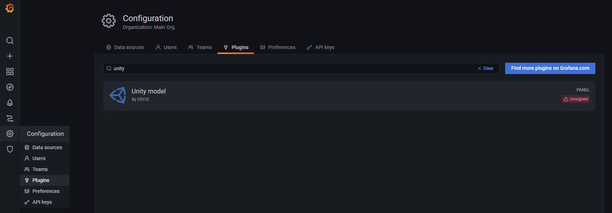
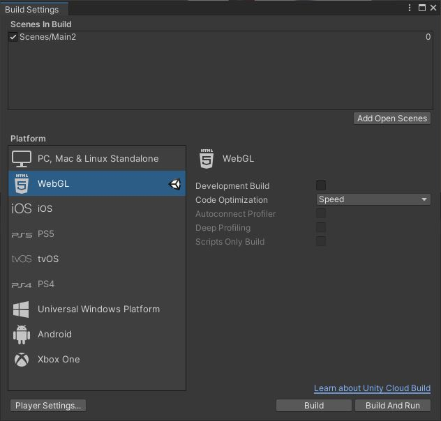
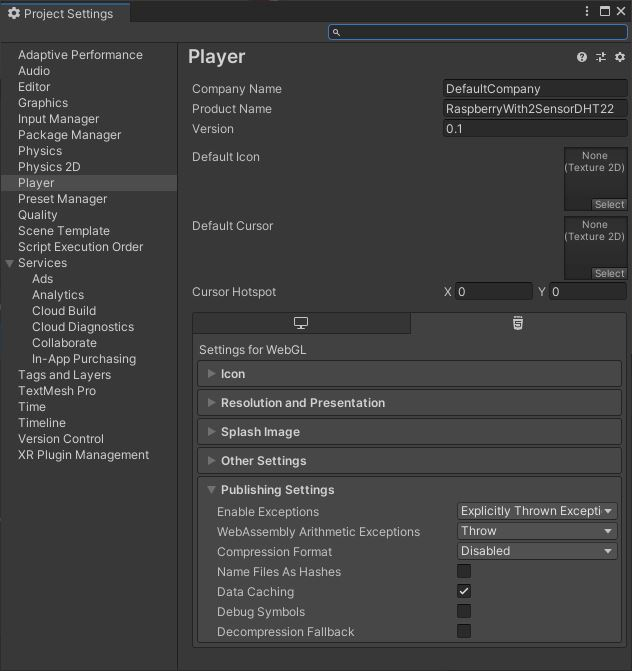

# Unity panel plugin

This plugin provides a solution to render Unity WebGL builds directly inside a Grafana panel, allowing its integration into any dashboard. It also enables a bi-directional interaction between Grafana and Unity. This means that the Unity build can take advantage of data coming from Grafana data sources, and in turn, the running build can send data to the dashboard, affecting the rest of the dashboard. Of course, if the Unity compilation allows users to interact with it, this functionality will still be possible even if it is within a Grafana dashboard. Although it was originally designed as an extension to [OpenTwins](https://github.com/ertis-research/opentwins), our digital twin platform, it has no dependency on it, making it a versatile tool suitable for a variety of scenarios.

## Table of Contents
- [Installation](#installation)
   - [Requirements](#requirements)
   - [Build plugin](#build-plugin)
- [Usage](#usage)
- [License](#license)

## Installation

### Requirements
- [Grafana >= 7.0](https://grafana.com/)
- [NodeJS >= 14](https://nodejs.org/es/)
- [yarn](https://yarnpkg.com/)

### Build plugin

This plugin is like any other Grafana plugin, so you can also follow the instructions on their page. It is also explained step-by-step below.

1. Download the code or clone it.
   ```bash
   git clone https://github.com/ertis-research/unity-plugin-for-grafana.git
   ```

2. Move the code to the folder you have assigned in Grafana for plugins. This folder is indicated in the Grafana [configuration file](https://grafana.com/docs/grafana/v9.0/setup-grafana/configure-grafana/#plugins), where you can also change its path if you see it convenient. 

3. The plugin is currently unsigned, so it is necessary to activate Grafana's development mode to use it. To do this, the [*app_mode*](https://grafana.com/docs/grafana/latest/setup-grafana/configure-grafana/#app_mode) variable in the Grafana configuration file must be changed to *development* and then Grafana must be [restarted](https://grafana.com/docs/grafana/v9.0/setup-grafana/restart-grafana/).

4. Access the root folder of the code in a terminal.

5. Run the following command to install the dependencies. 
   ```bash
   yarn install
   ```

6. Run the following command to build the plugin.
   ```bash
   yarn dev
   ```
7. For Grafana to detect the plugin for the first time it usually needs to be [restarted](https://grafana.com/docs/grafana/v9.0/setup-grafana/restart-grafana/).

At this point the plugin should already be installed and activated. If we go into Grafana and enter `configuration > plugins`, it will be in the list. 



## Usage

### Unity build requirements
The content of the Unity build will depend on what is being reproduced, but **in all cases it must have certain requirements**. 

The Unity model shall include the X script, which basically removes the capture of all keyboard inputs by Unity. This will allow the rest of the Grafana dashboard functions to still be used without any problems. This script should be added to any element of the model that will always be rendered (e.g. the main camera). You can also skip the file and add the instruction it contains directly to one of your scripts, the important thing is that you disable that function.

In addition to this script, it is important to build the Unity model correctly. In `File > Build Settings...` choose the **WebGL format** and in `Player Settings...` disable the compression format. It is not necessary to modify the default value of the rest of the other build options.

Build Settings             |  Project Settings  
:-------------------------:|:-------------------------:
  |  

Once we click on *Build* we will obtain 4 files that we will need to load the model in the panel.

### Adding Unity panel to Grafana dashboard

### Load Unity build in the panel

### Unity to Grafana interaction

### Grafana to Unity interaction

## License
